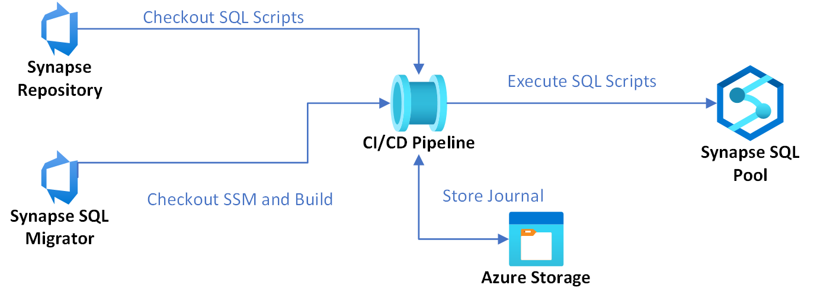

# Synapse SQL Migrator

The Synapse SQL Migrator was created to help facilitate the migration and CI/CD process for SQL Serverless database tables and views.  

> Note: At the time of writing, SSDT does not support SQL Serverless.  This was created to bridge that gap. 

This tool uses the third party [DbUp library](https://github.com/DbUp/DbUp) to help run SQL migrations that are included as part of a SQL Serverless deployment in Synapse.   This tool also uses Azure Blob Storage to keep track of previously run scripts via a CSV file.  Additionally, it uses Azure AD to authenticate against the SQL serverless database. Basically this tool is a superset of features on top of DbUp. 

It is expected that this be run as *part* of a CI/CD pipeline in either Azure DevOps or GitHub using GitHub Actions. The tool however can be used externally of those tools if required.  



## Authentication Specifics

The Synapse SQL Migrator uses a service principal to authenticate to both blob storage (where the migration history is kept), as well as to authenticate to the Synapse 
SQL serverless database. 

### Database
For the SQL Serverless database, you must add the service principal and grant the required permissions.  Example:
```sql
CREATE USER SynapseCICDServicePrincipalName FROM EXTERNAL PROVIDER
GRANT CREATE TABLE, CREATE VIEW, ALTER, VIEW DEFINITION TO SynapseCICDServicePrincipalName
```

### Storage
Storage is used as a method of tracking which SQL scripts have been executed, so that they aren't run again. Because of this, the service principal must have either **Storage Blob Contributor** access on the container or storage account, **or** must have the correct ACLs set.  

## General Guidance
The SQL scripts written should be written in such a way that they guard against database objects already existing, and be able to be run again.  Since data does not actually exist at the database level, and exists on storage, dropping and recreating external tables, data sources, etc should have result in no negative effects. 

For example, before creating an external table, check if the table exists:
```sql
IF EXISTS (SELECT * FROM sys.tables t inner join sys.schemas s on t.schema_id = s.schema_id where t.name = 'Fishes' and s.name = 'OCEAN')
    DROP EXTERNAL Table SWIM.Flightplans
GO
```

Do this with schemas and other objects as well: 
```sql
if not exists (SELECT * FROM sys.schemas where name = 'OCEAN')
    EXEC('CREATE SCHEMA OCEAN')
GO
```

This allows scripts to be rerun if required, to get the serverless sql pool up to date.  

> **Important**: If using the SynapseSQLMigrator against the dedicated pool, this guidance does **not** apply.  **Do not** drop databases or other objects in the SQL migrations scripts before a `CREATE` statement.  This could result in unexpected data loss. 

## Usage

The SSM (Synapse SQL Migrator) is used and executed via command line arguments.  Below lists the argument and the description of that argument.  All arguments are required unless specified as optional. 

| Argument | Description | 
|----------|-------------|
| --storage | This is the storage account name where the migration history is kept |
| --container | The container in the storage account where to save the migrations journal |
| --path | The relative path in the container of the storage account of where to save the migrations journal |
| --spid | The service principal client ID of the SP that will be used for authentication | 
| --sppass | The service principal secrete used to authenticate the SP | 
| --tenantid | The tenant ID that the service principal belongs to |
| --sqlserver | The SQL server name of the Synapse Serverless database, example `bestserver-ondemand.sql.azuresynapse.net` |
| --sqldb | The name of the SQL serverless database to run migrations against |
| --scriptspath | The local path, absolute or relative, of a directory containing script files.  Optional and defaults to the local_working_directory/Scripts | 

## CI/CD Pipelines

At a high level, the following process should be followed when building out a CI/CD process for SQL serverless database objects.
1. Clone the Synapse SQL Migrator repo. 
2. Build/publish the solution.
3. Run `dotnet SynapseSqlMigrator.dll` with the required arguments. (This step executes the SQL scripts against the serverless pool).
4. Clean up.
5. Continue with other CI/CD tasks/steps. 

### GitHub

A [sample github workflow](ExampleGithubAction.yml) is included in this repo.  Use this workflow within your Synapse repo or wherever your SQL migration scripts are located.  Update the environment variables and create one repo secret called `SERVICE_PRINCIPAL_SECRET`.  Set its value to the service principal's secret. 